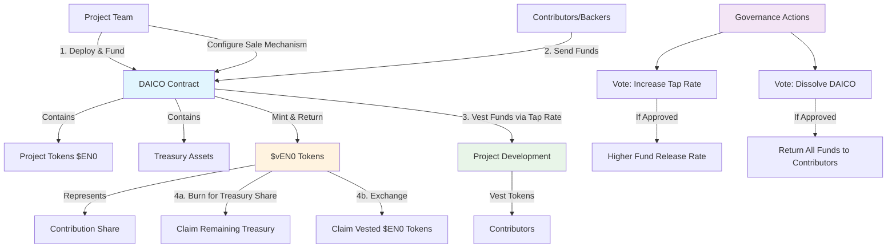

# DAOICO

In 2018, Vitalik wrote a [blog post](https://ethresear.ch/t/explanation-of-daicos/465) about DAICOs, a better way to do ICOs, designed to counter some of the bad behavior emerging out of ICOs of the 2017 era.

This paper serves to outline the approach we'll take with the EN0VA DAICO.

**Our goals:**
1. More adequately align incentives of the project with contributors and early backers.
2. Accumulate a multi-asset treasury.
3. Support a capital raising mechanism that can be continuous throughout the duration of the project.

**Why?**
- To create a more equitable and sustainable funding model for projects.
- To ensure that contributors and early backers have a vested interest in the success of the project.
- To provide a more transparent and democratic way of managing project funds.
- To ensure that the project team has a vested interest in the success of the project.

**How it works (high level):**
- Project creates a DAICO contract, funds it with project tokens, and configures a sale mechanism (bonding curve, dutch auction, etc.)
- Users put funds in in the DAICO contract, get $vEN0 tokens representing their contribution share
- DAICO vests funds to project, project vests funds to contributors
- At any point they can burn their $vEN0 tokens for their share of what's left of the DAICO treasury, or exchange them to claim vested $EN0 tokens
- Two governance actions are supported, voting to increase the `tap` rate and voting to dissolve the DAICO entirely and return everyone their funds.



## EN0VA DAICO Spec

In his original post, Vitalik stated "Once the contribution period ends, the ability to contribute ETH stops, and the initial token balances are set; from there on the tokens can become tradeable."

We aim to diverge from this slightly. Namely, tokens will be vested bi-directionally. This allows for existing projects to leverage a DAICO mechanic for raising additional funds. [why else?]

Maybe we don't want to diverge from this?

We may also want to consider a refundable crowdsale, where people can withdraw if a funding goal is not met.

EN0VA DAICO will be based on the tokenized vault standard `ERC-4626`, allowing for unvested tokens in the vault to earn yield in low-risk strategies.


## Pricing

There are a number of options for pricing tokens during the DAICO:
- Fixed Price
- Dynamic Price (Dutch Auction)
- Bonding curves
- Step pricing (maybe doesn't need vesting on the project tokens side)
- Option drops (whitelisted addresses only can participate in special private rounds at a discounted price, must meet a certain threshold of reputation)

A VRGDA (Variable Rate Gradual Dutch Auction), see [this post](https://www.paradigm.xyz/2022/08/vrgda) might be interesting.

Step pricing seems sensible, and naturally aligns with a phase based approach. Needs legal review, as it may conflict with most favored nations clause (however our investors can choose to participate in the DAICO).

Dutch Auction is great, because we don't have to worry about annoying our investors by potentially selling for less than the price they paid (or at least we have no control over that).

Everyone likes / is familiar with bonding curves these days... but they tend to reward snipers.

We may want to do more Lock Drop style drop when we launch the bridge.

Step pricing may be best?

## DAICO Implementation

We should potentially consider options to add additional taps?

Maybe the team should be able to change tap address? So if a new gauge system is introduced, it can be swapped out for a new one.

## Open Question

- One big DAICO? Or phased approach?
- If we go with a phased approach where do the tokens sit that are set asside for that? How do we make sure they are earmarked in a credible way?
- How does the DAICO relate to the option drop? To participate you must accumulate points? Or maybe the option drop is a secondary mechanic?
- Where do funds from the tap go? Project multisig initially?

## Parameters

## Design Considerations

### Core Principles
1. **Simplicity First**: One contribution asset, clear pricing, minimal governance
2. **ERC4626 Native**: Leverage vault standard for deposits, withdrawals, and share accounting
3. **Continuous Funding**: Support ongoing contributions rather than fixed windows
4. **Aligned Incentives**: Tap mechanism ensures project can't run away with funds

### Key Design Decisions

#### Single Asset Treasury
- Accept only one asset (e.g., USDC) to avoid pricing complexity
- No need for oracles or cross-asset valuations
- Simpler accounting and refund mechanics

#### VRGDA Pricing Mechanism
- Variable Rate Gradual Dutch Auction for continuous, self-regulating fundraising
- Price automatically adjusts based on actual vs target sales rate
- Increases price when demand is high (ahead of schedule)
- Decreases price when demand is low (behind schedule)
- No need for manual price adjustments or fixed windows

#### Governance Minimalism
- Only two governance actions: increase tap rate and dissolve
- Use vToken holdings as voting power (no snapshots needed)
- Simple majority with quorum for decisions

#### Vesting Simplification
- Project tokens vest linearly to vToken holders
- No complex cliff or revocation logic initially
- Tap rate provides natural vesting for project funds

## Simplified Interface

```solidity
// SPDX-License-Identifier: MIT
pragma solidity ^0.8.20;

import {IERC4626} from "@openzeppelin/contracts/interfaces/IERC4626.sol";

/**
 * @title IDAICO
 * @notice Interface for Decentralized Autonomous Initial Coin Offering (DAICO) contracts
 * @dev Extends ERC4626 for tokenized vault functionality with yield-earning capabilities
 */
interface IDAICO is IERC4626 {
    // ============ Enums ============

    enum ProposalType {
        INCREASE_TAP,
        DISSOLVE
    }

    enum ProposalStatus {
        ACTIVE,
        SUCCEEDED,
        EXECUTED,
        DEFEATED
    }

    // ============ Structs ============

    struct Config {
        address projectToken; // The EN0 token being distributed
        uint256 projectTokenSupply; // Total project tokens in DAICO
        uint256 tapRate; // Wei per second that can be withdrawn
        address tapRecipient; // Address receiving tap withdrawals
        uint256 minRaise; // Minimum amount for refundable crowdsale
        uint256 vestingDuration; // Linear vesting period for project tokens
        // VRGDA Parameters
        int256 targetPrice; // Starting price per token in contribution asset
        int256 priceDecayPercent; // Rate of price decay (in basis points per unit)
        int256 perTimeUnit; // Target tokens to sell per time unit
    }

    struct Proposal {
        ProposalType proposalType;
        uint256 value; // New tap rate if INCREASE_TAP
        uint256 endBlock;
        uint256 forVotes;
        uint256 againstVotes;
        ProposalStatus status;
    }

    // ============ Events ============

    event TapWithdrawn(uint256 amount);
    event TapRateUpdated(uint256 newRate);
    event ProjectTokensClaimed(address indexed holder, uint256 amount);
    event ProposalCreated(uint256 indexed proposalId, ProposalType proposalType);
    event VoteCast(uint256 indexed proposalId, address indexed voter, bool support, uint256 weight);
    event ProposalExecuted(uint256 indexed proposalId);
    event DAICODissolved();

    // ============ Core Functions ============
    // Note: deposit() and redeem() from ERC4626 handle contributions and treasury claims

    /**
     * @notice Get current VRGDA price for a given amount of tokens
     * @param amount The amount of tokens to price
     * @return price The current price in contribution asset
     */
    function getCurrentPrice(uint256 amount) external view returns (uint256 price);

    /**
     * @notice Get spot price for next token
     * @return price The spot price for the next token
     */
    function getSpotPrice() external view returns (uint256 price);

    /**
     * @notice Claim vested project tokens based on vToken holdings
     * @return amount The amount of project tokens claimed
     */
    function claimProjectTokens() external returns (uint256 amount);

    /**
     * @notice Get claimable project tokens for an address
     * @param account The address to check
     * @return amount The claimable amount
     */
    function getClaimableProjectTokens(address account) external view returns (uint256 amount);

    /**
     * @notice Withdraw available funds according to tap rate (only tapRecipient)
     */
    function withdrawTap() external;

    /**
     * @notice Get the amount available to withdraw via tap
     * @return amount The amount available
     */
    function getAvailableTap() external view returns (uint256 amount);

    // ============ Governance Functions ============

    /**
     * @notice Create a governance proposal
     * @param proposalType The type of proposal
     * @param value The new tap rate (only for INCREASE_TAP)
     * @return proposalId The ID of the created proposal
     */
    function createProposal(ProposalType proposalType, uint256 value)
        external
        returns (uint256 proposalId);

    /**
     * @notice Vote on a proposal
     * @param proposalId The ID of the proposal
     * @param support Whether to vote for or against
     */
    function vote(uint256 proposalId, bool support) external;

    /**
     * @notice Execute a successful proposal
     * @param proposalId The ID of the proposal to execute
     */
    function executeProposal(uint256 proposalId) external;

    // ============ View Functions ============

    /**
     * @notice Get the DAICO configuration
     * @return The current configuration
     */
    function config() external view returns (Config memory);

    /**
     * @notice Get proposal details
     * @param proposalId The proposal ID
     * @return The proposal details
     */
    function getProposal(uint256 proposalId) external view returns (Proposal memory);

    /**
     * @notice Check if minimum raise has been met
     * @return Whether minimum has been met
     */
    function isMinRaiseMet() external view returns (bool);

    /**
     * @notice Check if the DAICO has been dissolved
     * @return Whether the DAICO is dissolved
     */
    function isDissolved() external view returns (bool);

    /**
     * @notice Get the last tap withdrawal timestamp
     * @return The timestamp of last tap withdrawal
     */
    function lastTapWithdrawal() external view returns (uint256);

    /**
     * @notice Check if address has voted on a proposal
     * @param proposalId The proposal ID
     * @param voter The voter address
     * @return Whether the address has voted
     */
    function hasVoted(uint256 proposalId, address voter) external view returns (bool);

    /**
     * @notice Get total tokens sold so far
     * @return The total number of tokens sold
     */
    function totalSold() external view returns (uint256);

    /**
     * @notice Get the VRGDA sale start time
     * @return The timestamp when VRGDA sales started
     */
    function saleStartTime() external view returns (uint256);

}
```

## Implementation Notes

### VRGDA Mechanics
The VRGDA price at any time is calculated as:
```
p(t) = p0 * (1 - k)^(f(t) - totalSold)
```
Where:
- `p0` = target price
- `k` = price decay percent
- `f(t)` = expected tokens sold by time t (perTimeUnit * time elapsed)
- `totalSold` = actual tokens sold

This creates a self-balancing mechanism where:
- If selling faster than target → price increases exponentially
- If selling slower than target → price decreases exponentially
- Natural price discovery without manual intervention

### Example VRGDA Configurations

#### Conservative Raise (Steady funding over 1 year)
```solidity
Config memory config = Config({
    projectToken: EN0_TOKEN,
    projectTokenSupply: 10_000_000e18, // 10M tokens
    tapRate: 100e18, // 100 USDC per second available to project
    tapRecipient: PROJECT_TREASURY,
    minRaise: 1_000_000e6, // 1M USDC minimum
    vestingDuration: 365 days,
    // VRGDA: Target 27,397 tokens/day (10M over 365 days)
    targetPrice: 100e6, // Start at $100 per token
    priceDecayPercent: 50, // 0.5% decay (50 basis points)
    perTimeUnit: 27397e18 // tokens per day
});
```

#### Aggressive Early Raise (Front-loaded funding)
```solidity
Config memory config = Config({
    projectToken: EN0_TOKEN,
    projectTokenSupply: 5_000_000e18, // 5M tokens
    tapRate: 500e18, // 500 USDC per second
    tapRecipient: PROJECT_TREASURY,
    minRaise: 5_000_000e6, // 5M USDC minimum
    vestingDuration: 180 days,
    // VRGDA: Target 100,000 tokens/day initially, slowing over time
    targetPrice: 200e6, // Start at $200 per token
    priceDecayPercent: 100, // 1% decay (stronger price elasticity)
    perTimeUnit: 100000e18 // tokens per day
});
```

### Price Adjustment Scenarios

#### Scenario 1: High Demand (Ahead of Schedule)
- Day 10: Expected 273,970 tokens sold, Actually sold 400,000
- Price multiplier: (1 - 0.005)^(-126,030) ≈ 1.87x
- Current price: $100 * 1.87 = $187 per token
- **Result**: Price increases to slow down purchases

#### Scenario 2: Low Demand (Behind Schedule)
- Day 30: Expected 821,910 tokens sold, Actually sold 500,000
- Price multiplier: (1 - 0.005)^(321,910) ≈ 0.20x
- Current price: $100 * 0.20 = $20 per token
- **Result**: Price decreases to incentivize purchases

#### Scenario 3: On Target
- Day 20: Expected 547,940 tokens sold, Actually sold 550,000
- Price multiplier: (1 - 0.005)^(-2,060) ≈ 1.01x
- Current price: $100 * 1.01 = $101 per token
- **Result**: Price stays nearly stable

### ERC4626 Integration with VRGDA
- `deposit(assets, receiver)` - Contributors deposit, receive vTokens based on VRGDA price
- `redeem(shares, receiver, owner)` - Burn vTokens to claim proportional treasury
- `totalAssets()` - Returns total contribution asset in treasury minus withdrawn tap
- `convertToShares()` - Uses VRGDA pricing to determine vTokens minted
- `convertToAssets()` - Standard proportional calculation for redemptions

### Governance Flow
1. Any vToken holder can create a proposal (with minimum threshold)
2. Voting period is fixed (e.g., 7 days)
3. Votes are weighted by vToken balance at proposal creation
4. Simple majority with 10% quorum for tap increase
5. Supermajority (67%) with 20% quorum for dissolution

### Project Token Distribution
- Linear vesting over `vestingDuration` starting from contribution
- Claimable amount = (vTokens / totalVTokens) * projectTokenSupply * (time elapsed / vestingDuration)
- Unclaimed tokens remain in contract until claimed

### VRGDA Integration with ERC4626

The key integration points for VRGDA with the vault standard:

1. **On Deposit (Contribution)**:
   ```solidity
   function deposit(uint256 assets, address receiver) returns (uint256 shares) {
       uint256 projectTokenAmount = calculateTokensForAssets(assets); // Uses VRGDA price
       shares = projectTokenAmount; // 1:1 vToken to project token
       totalSold += projectTokenAmount;
       // Standard ERC4626 deposit logic...
   }
   ```

2. **Price Calculation**:
   ```solidity
   function calculateTokensForAssets(uint256 assets) internal view returns (uint256) {
       // Integration to get tokens at current VRGDA price
       // May need to handle partial fills if not enough supply
   }
   ```

3. **View Functions**:
   - `previewDeposit()` - Shows expected vTokens using current VRGDA price
   - `maxDeposit()` - Limited by remaining project token supply
   - `convertToShares()` - Dynamic based on VRGDA price at deposit time

### Advantages of VRGDA for DAICOs

1. **Self-Regulating**: No need for manual price adjustments or sale phases
2. **Continuous Funding**: Works perfectly with ongoing contribution model
3. **Market Responsive**: Price reflects actual demand in real-time
4. **Predictable for Project**: Steady funding rate aligned with development needs
5. **Fair for Contributors**: Early supporters get better prices, but latecomers aren't priced out
6. **Anti-Manipulation**: Exponential pricing makes it expensive to corner the market

## vToken Speculation Dynamics

### Yes, vTokens Are Speculative Assets!

vTokens create a fascinating dual-market dynamic where holders can speculate on multiple outcomes:

### Speculation Opportunities

#### 1. **Treasury Redemption Play**
- vTokens can be redeemed for proportional share of remaining treasury
- If DAICO raises $10M and tap only withdraws $2M before dissolution → 80% redemption value
- Speculate that project will be dissolved early with significant treasury remaining
- Buy vTokens on secondary market below treasury NAV for instant arbitrage

#### 2. **Project Token Vesting Play**
- vTokens can be exchanged for vested EN0 project tokens
- If EN0 tokens trade at $500 but VRGDA price is $200 → 2.5x multiplier
- Accumulate vTokens to claim cheap EN0 tokens as they vest
- Creates a "warrant-like" instrument with time value

#### 3. **Governance Power Play**
- vTokens = voting power for tap increases and dissolution
- Accumulate vTokens to control project funding destiny
- Activist investors could force dissolution for redemption
- Project supporters could increase tap to accelerate development

#### 4. **VRGDA Arbitrage**
- VRGDA price changes create arbitrage windows
- Buy from DAICO when price is low (behind schedule)
- Sell vTokens on secondary when VRGDA price rises
- Or hold for treasury/project token value if that exceeds purchase price

### Secondary Market Dynamics

```
vToken Market Price Factors:
├── Treasury NAV (floor value)
├── EN0 token price * vesting ratio (upside value)
├── VRGDA current price (opportunity cost)
├── Governance premium (control value)
└── Time value (vesting acceleration)
```

### Speculation Strategies

#### Bull Case Speculation
- **Bet**: Project succeeds, EN0 moons, vTokens claim cheap EN0
- **Strategy**: Buy vTokens below (EN0 price * vesting %)
- **Risk**: Project could fail or EN0 could dump
- **Reward**: Leveraged exposure to EN0 upside

#### Bear Case Speculation
- **Bet**: Project fails, dissolution returns treasury
- **Strategy**: Buy vTokens below treasury NAV
- **Risk**: Project could succeed and drain treasury via tap
- **Reward**: Protected downside with treasury floor

#### Volatility Speculation
- **Bet**: vToken price swings create trading opportunities
- **Strategy**: Trade the spread between VRGDA, NAV, and market price
- **Risk**: Low liquidity, wide spreads
- **Reward**: Multiple arbitrage angles

### Implications for the DAICO

#### Positive Effects
1. **Price Discovery**: Secondary market provides real-time project valuation
2. **Liquidity**: Contributors can exit before vesting/dissolution
3. **Governance Participation**: Speculation brings active governance
4. **Funding Efficiency**: Arbitrageurs ensure VRGDA stays on target

#### Potential Concerns
1. **Governance Attacks**: Speculators might force premature dissolution
2. **Price Manipulation**: Whales could corner vToken market
3. **Misaligned Incentives**: Short-term traders vs long-term builders
4. **Complexity**: Multiple pricing layers confuse retail

### Mitigation Mechanisms

To balance speculation with project stability:

1. **Dissolution Threshold**: Require 67% supermajority to dissolve
2. **Vesting Cliffs**: Delay project token claims to prevent quick flips
3. **Governance Timelock**: Delay proposal execution by 48-72 hours
4. **Tap Rate Limits**: Cap maximum tap increase per period
5. **Anti-Whale Measures**: Cap maximum vToken holdings per address

### Market Making Opportunities

vTokens create natural market making opportunities:
- **Primary ↔ Secondary**: Arbitrage between VRGDA and market price
- **vToken ↔ EN0**: Arbitrage vesting discount vs market price
- **Treasury ↔ Market**: Arbitrage NAV discount vs market price

This creates a rich, multi-layered market that:
- Provides continuous price discovery
- Enables various risk/reward profiles
- Attracts sophisticated capital
- Maintains alignment through skin in the game
